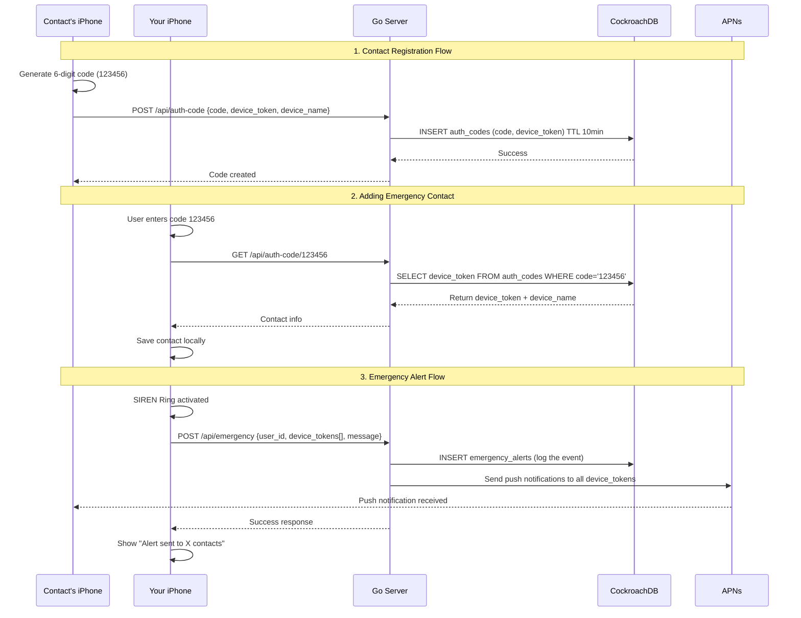
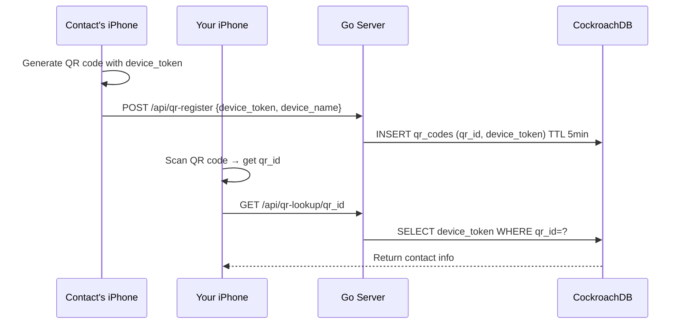
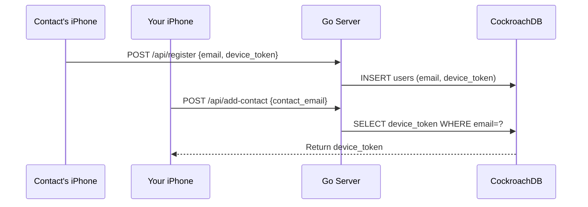
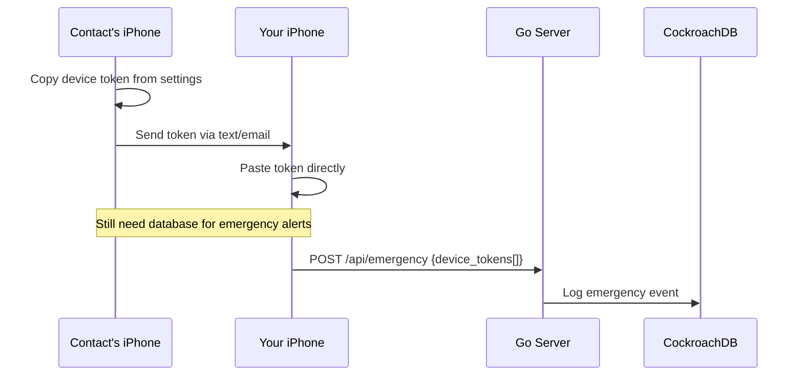
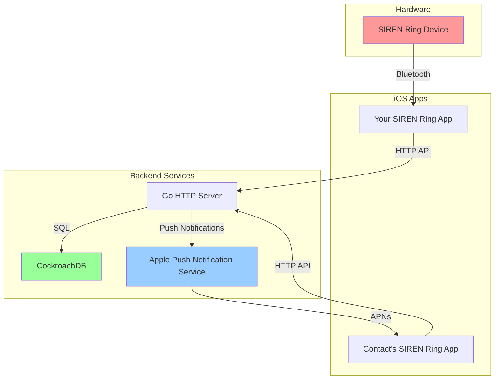

# SIREN Ring System Architecture Flow

## Current 6-Digit Code Flow

## Alternative Connection Methods (All Need Database)

### QR Code Flow

### User Account System

### Direct Token Sharing (No intermediary)

## System Components

